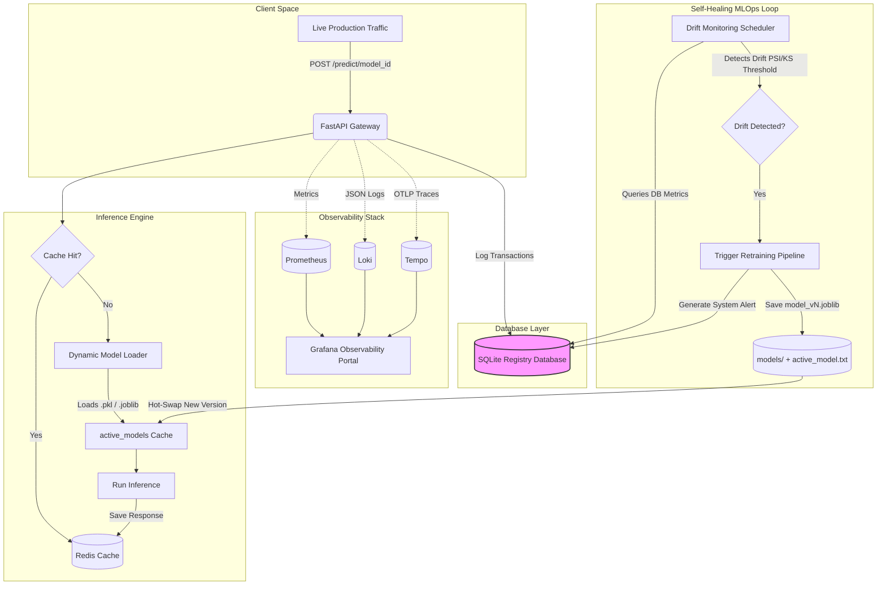

# MLOps Observability & Model Monitoring Platform

A production-grade **MLOps Observability & Model Monitoring Platform** for scikit-learn models (`.pkl` / `.joblib`). It includes a FastAPI inference gateway, **manual filesystem + SQLite model registry**, observability (Grafana, Prometheus, Loki, OpenTelemetry, Tempo), drift detection, and automated retraining.

---

### 🚨 The Problem: "Silent Failure in Production Machine Learning"
Once Machine Learning models are deployed into production, they do not remain static. Over time, model performance degrades due to **Data Drift**—a phenomenon where live incoming production features skew or deviate from the historical baseline distributions the model was originally trained on.

Traditional ML architectures treat deployment as the final step. They lack continuous statistical monitoring, meaning models can confidently make incorrect predictions for weeks before engineers notice a drop in critical business KPIs.

### 💡 The Solution: "Self-Healing MLOps Architecture"
This platform implements a fully closed-loop, self-healing model lifecycle. It integrates a real-time FastAPI inference engine with a unified "single pane of glass" observability stack and an automated retraining and redeployment workflow.

#### **Final Workflow:**
```
Upload Model ➔ Register Model ➔ Deploy Model ➔ Start Monitoring ➔ Detect Drift ➔ Generate Alerts ➔ Trigger Retraining
```

**Key Observability Features:**
1. **Manual Model Registry:** Versioned artifacts on disk (`models/{model_id}/model_v1.joblib`, `model_v2.joblib`, …) with `active_model.txt` for the live deployment. SQLite stores version, filename, accuracy, training time, and ACTIVE/INACTIVE status.
2. **Generic Drift Detection Engine:** A background scheduler continuously monitors inference queries, comparing live distributions against baseline data using statistical methods:
   - **Population Stability Index (PSI)** for discrete categorical target distributions.
   - **Kolmogorov-Smirnov (KS) Test** for continuous numerical regressions/features.
3. **Automated Self-Healing Pipeline:** On critical drift, retrains on logged production data, saves `model_vN.joblib`, updates SQLite, writes `active_model.txt`, and hot-reloads the in-memory estimator.
4. **Operations Telemetry:** Collects operational metrics (latency, throughput, error rate, model certainty) via OpenTelemetry, Prometheus, Loki logs, and Tempo distributed traces.
5. **Interactive Prediction Sandbox:** Test different inputs on deployed models, automatically generating realistic feature payloads for popular domain schemas.

---

## 🏛️ Architecture & Workflow



---

## 📁 Project Structure

```bash
app/
├── api/                # FastAPI endpoints & multi-model predict routing
├── models/             # Dynamic binary model loader & cache
├── drift/              # Statistical PSI/KS drift detection algorithms
├── monitoring/         # Background drift scheduler
├── retraining/         # Automated self-healing retraining pipeline
├── tracing/            # OpenTelemetry & distributed tracing instrumentation
└── logging/            # Structured JSON telemetry logging
grafana/
└── provisioning/       # Custom Grafana dashboard and datasource configs
scripts/
└── setup_dvc.bat       # DVC initialization script
tests/
└── test_api.py         # Pytest suite validating dynamic registry & routing
traffic_generator.py    # Production traffic & feature skew simulator
```

---

## 🛠️ Setup and Running Locally

1.  **Initialize DVC and Track Data:**
    ```bash
    # Windows
    .\scripts\setup_dvc.bat
    ```

2.  **Create External Docker Network:**
    ```bash
    docker network create monitoring
    ```

3.  **Build and Start Services:**
    ```bash
    docker compose up -d --build
    ```

4.  **Access the Platform Locally:**
    *   **Custom MLOps Dashboard:** [http://localhost:5173](http://localhost:5173) (Premium UI)
    *   **Inference API Gateway:** `http://localhost:8000`
    *   **Grafana Dashboard:** [http://localhost:3000](http://localhost:3000) (admin / admin)
    *   **Prometheus Console:** [http://localhost:9090](http://localhost:9090)

---

## 🌐 Cloud & Multi-Host Deployment (AWS, Vercel, Railway)

The platform is designed to run in a distributed multi-host cloud setup. 

### 1. Backend & Observability Stack (AWS EC2)
The stateful containers (FastAPI, Redis, SQLite, Prometheus, Grafana, Loki) run on your **AWS EC2** server.

1. **Inbound Port Setup (AWS Console)**:
   Ensure your Security Group allows inbound TCP traffic on:
   * **`8000`** (FastAPI backend API)
   * **`3000`** (Grafana dashboard)

2. **Deploy on AWS**:
   ```bash
   ssh -i "path/to/key.pem" ubuntu@<AWS_IP>
   cd drift-watch
   git pull origin main
   sudo docker compose up -d --build
   ```

### 2. Frontend React Client (Vercel)
Deploy your frontend static files to **Vercel** to keep it fast, global, and separate from your backend compute.

1. Create a Vercel project and import your repository.
2. Set the **Root Directory** setting to `frontend/`.
3. Add the following **Environment Variable**:
   * **Key**: `VITE_BACKEND_IP`
   * **Value**: `<Your_AWS_Public_IP>`
4. Click **Deploy**.

> **Note on Browser Security (Mixed Content Block):**
> Because Vercel serves the UI over secure HTTPS, modern browsers block insecure HTTP requests to your raw AWS IP. To bypass this for development, click the site settings slider in the URL bar, go to **Site Settings**, scroll to **Insecure Content**, change to **Allow**, and reload. For production, map a domain and add an SSL certificate using Nginx and Certbot.

### 3. Frontend Self-Healing Local Fallback
If you are running the frontend locally (`localhost`) but configure it to talk to a remote AWS backend, the frontend will automatically check the connection. If the AWS backend connection fails (e.g. port closed or server offline), the UI will automatically fall back to `localhost` to keep your system operational!

---

## 📦 Manual Registry API

| Endpoint | Description |
|----------|-------------|
| `POST /models/upload` | Register a new version (`model_v1.joblib`) |
| `GET /models` | List models with active version |
| `GET /models/{id}/versions` | List all versions + metadata |
| `GET /models/active/{id}` | View deployed version + `active_model.txt` |
| `POST /models/{id}/activate?version=v2` | Deploy a version |
| `POST /retrain/{id}` | Retrain from production logs |

**On-disk layout:**
```
models/fraud_detector/
  model_v1.joblib
  model_v2.joblib
  active_model.txt    # contains: model_v2.joblib
```

> **Upgrade note:** Delete `data/mlops.db` once if you need to recreate the new schema catalog.

---

## 📊 Recommended Demo Models

The platform is designed to dynamically monitor any tabular or statistical model. Out-of-the-box, the simulator supports three classic enterprise business problems:

### 1. Fraud Detection (Classification)
* **Model ID:** `fraud_detector`
* **Features:** `amount`, `distance`, `is_international`
* **Workflow:** Identifies high-risk transactions. Auto-triggers retraining when purchase amounts or transaction distances dramatically drift from the baseline distribution.

### 2. Customer Churn (Classification)
* **Model ID:** `customer_churn`
* **Features:** `tenure`, `monthly_charges`, `support_calls`
* **Workflow:** Identifies high-churn risk subscribers. Triggers retraining when monthly fees spike or tenure records skew.

### 3. House Price Prediction (Regression)
* **Model ID:** `house_price_predictor`
* **Features:** `sqft`, `bedrooms`, `bathrooms`, `age`
* **Workflow:** Predicts property values. Evaluates drift continuously using the continuous Kolmogorov-Smirnov statistical test.

---

## 🧪 Testing the Self-Healing Pipeline

1.  **Launch Production Inference Traffic:**
    ```bash
    python traffic_generator.py --interval 1.5
    ```
    *This generates normal baseline requests aligned with the schemas of currently active models in the registry.*

2.  **Inject Feature Skew (Data Drift):**
    To simulate a sudden shift in production data distributions:
    ```bash
    python traffic_generator.py --drift --interval 1.0
    ```
    *This pumps skewed features (e.g. 10x purchase amount spikes). Watch the yellow **Drift Score** on the UI dashboard card spike.*

3.  **Observe Auto-Retraining:**
    - The background `DriftScheduler` running inside FastAPI will detect the statistical drift within 15 seconds.
    - Check the backend logs or Grafana Retraining Panel. You will see `🚨 CRITICAL DRIFT ALARM` followed by `Starting automated retraining pipeline...`.
    - The pipeline retrains, saves `model_v2.joblib`, updates **active_model.txt**, and hot-swaps without shutting down.

4.  **Manual Retraining Trigger:**
    ```bash
    curl -X POST "http://localhost:8000/retrain/fraud_detector"
    ```

5.  **Run Automated CI/CD Tests:**
    ```bash
    pytest tests/
    ```
