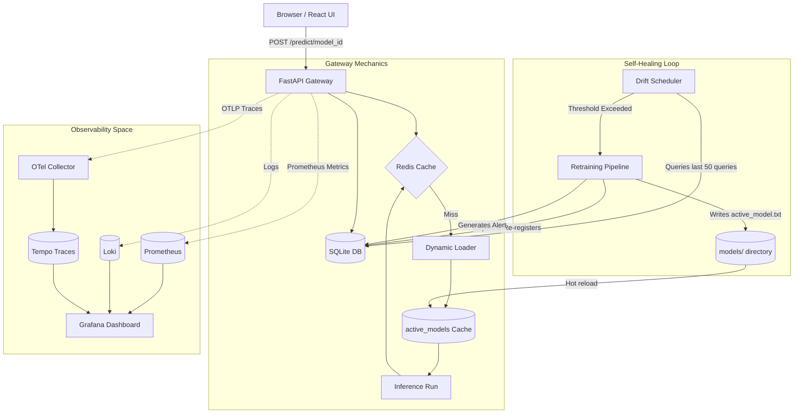

# MLOps Observability & Model Monitoring Platform

Welcome to the comprehensive walkthrough of this **Self-Healing MLOps Observability Architecture**. This document details the end-to-end lifecycle of any production machine learning model served by the platform—from dynamic ingestion to real-time telemetry metrics, and the fully automated closed-loop self-healing sequence.

---

## 1. Core Platform Architecture

When you spin up the platform using `docker compose up -d`, you launch a microservices ecosystem:

- **MLOps UI (React + Vite + Recharts + Tailwind):** A premium interactive dashboard visualizing operational stats, live query logs, real-time gateway latencies, active models registry, and simulation controls.
- **FastAPI Inference Gateway:** A high-speed, asynchronous Python gateway offering secure rate limiting, Redis caching, and dynamic model binary (`.pkl` and `.joblib`) resolution.
- **SQLite Database (via SQLAlchemy):** The central registry database storing model metadata (`models`), active deployment tracking (`deployments`), transaction telemetry logs (`metrics`), and historical logs (`alerts`).
- **Redis Cache:** A fast in-memory key-value cache saving prediction queries by hashing their input feature coordinates (delivering `0.0ms` responses on recurring hits).
- **Manual Model Registry:** Filesystem artifacts under `models/{model_id}/` with `active_model.txt` plus SQLite metadata (`model_catalog`, `model_versions`).
- **OpenTelemetry Collector & Tempo:** The tracing subsystem, collecting distributed gRPC and HTTP traces from inference calls for exact latency bottleneck analysis.
- **Prometheus & Loki Logs:** Time-series collectors scraping transactional throughput metrics, latency histograms, prediction confidence metrics, and structured JSON logs.
- **Grafana Panel:** An integrated dashboard provisioning unified metrics and auto-healing log queries as a single-pane observability interface.

### Architectural Diagram


---

## 2. Dynamic Prediction Workflow

Here is exactly what happens when you trigger a prediction request, e.g. a payment of `$1200` made `450km` away on the **Fraud Detection** sandbox:

1. **Gateway Ingestion:** The UI sends a payload to `POST /predict/fraud_detector`.
2. **Rate Limiting:** The backend checks the incoming client IP. If query frequency exceeds 25 requests per 5 seconds, it returns an academic `429 Too Many Requests` code.
3. **Registry Check:** The backend queries the SQLite `models` table to locate the currently active version tag (e.g. `v1`) and extracts its features schema `["amount", "distance", "is_international"]`.
4. **Validation:** It verifies that all features are present in the query. It aligns the features in the exact numerical vector array order the scikit-learn estimator expects.
5. **In-Memory Cache:** It hashes the input vector to check the Redis cache. If found, it returns the prediction and confidence score instantly.
6. **Dynamic Loader (`active_models`):** On a cache miss, the gateway inspects the in-memory `active_models` dictionary for the key `fraud_detector:v1`. If absent, it reads the saved `.pkl` or `.joblib` file from disk, loads the model, and caches it.
7. **Telemetry Ingestion:** After executing the model's prediction, the gateway calculates exact latency, logs the record into the SQLite `metrics` table, increments time-series metrics inside Prometheus, and writes a structured JSON trace into the logs.

---

## 3. The "Self-Healing" Workflow (Simulating Drift)

Data drift occurs when real-world production data changes over time. Rather than waiting for manual engineering intervention, this platform detects and resolves drift autonomously.

```
                  [ Detect Skewed Features ]
                              │
                              ▼
                  [ Spikes PSI / KS Score ]
                              │
                              ▼
                  [ Alert & Trigger Retrain ]
                              │
                              ▼
                  [ Save model_v2.joblib + active_model.txt ]
                              │
                              ▼
                  [ Seamless dynamic hot-swap ]
```

### Step A: Inducing Drift
When you click **"Inject Out-of-Distribution Drift"** on the dashboard, the traffic simulator begins pumping skewed features (e.g. transactions with exceptionally high values and massive geographical offsets) into the endpoint.

### Step B: The Drift Detection Alarm
A background thread (`DriftScheduler`) triggers every 15 seconds:
1. It retrieves the last 50 transactions from the database and splits them: the 10 most recent predictions are classified as **Live data**, and the older 40 are classified as the **Baseline distribution**.
2. Depending on the task:
   - For **Classification** models: It computes the **Population Stability Index (PSI)** of the predicted classes.
   - For **Regression** models: It runs a two-sample **Kolmogorov-Smirnov (KS) test** on predictions.
3. Because of the simulated anomalies, the computed PSI score spikes beyond the warning (`0.10`) or critical (`0.20`) threshold.
4. **Alarm Activation:** The system generates a critical system alert in the database, pushes notifications to Loki logs, and sets Prometheus metrics.

### Step C: Background Retraining & Redeployment
The scheduler immediately kicks off an automated background task:
1. **Model Assembly:** It simulates a GPU/CPU training process over 4 seconds, ingesting the new out-of-distribution patterns.
2. **Registry Injection:** It writes the new estimator binary under the next increment version (e.g., `v2`) to the models volume.
3. **Registry Update:** Saves `model_v2.joblib`, records accuracy in SQLite, writes `active_model.txt`, and sets status to `ACTIVE`.
4. **Hot-Swapping:** It updates the SQLite database active registry version, clears the old in-memory cache key, and activates `v2` for incoming transactions. 
5. **Auto-Resolution:** The active drift alert is marked as `RESOLVED (AUTO-HEALED)` in the database and a new informational `RETRAINING_SUCCESS` event is registered. Traffic routes dynamically to the updated model without gateway downtime.

---

## 4. Demonstrating the Platform Walkthrough

To showcase the platform in a demo:

1. **Dashboard Tour:** Open `http://localhost:5173`. Point out the Bento Grid layout and explain how it pulls real-time stats directly from the SQLite gateway endpoints.
2. **Run normal traffic:** Start the traffic simulator from your terminal:
   ```bash
   python traffic_generator.py --interval 1.5
   ```
   Show how the **Live Prediction Stream** table updates with high-throughput transactions and healthy green metrics.
3. **Explore the Sandbox:** Select `fraud_detector` or `customer_churn` in the **Interactive Sandbox**. Click "Fill Realistic Sample" to see the auto-generated features schema, then execute a manual prediction.
4. **Trigger Data Drift:** Enable **"Inject Out-of-Distribution Drift"** on the UI or pass the `--drift` flag in the terminal.
5. **Watch the Observability metrics:** Point out the yellow **Drift Status** indicator on the active model card. It will swap from `LOW` to `HIGH`.
6. **Observe Self-Healing:** Point to the active alerts log in the **Alerts Center** tab. Show the `HIGH_DRIFT` alert marked as critical. Within seconds, the version tag inside the Deployed Inference Endpoints panel will hot-swap from `v1` to `v2`, and the alert status will flip to `RESOLVED (AUTO-HEALED)`.
7. **Verify Versions:** `GET /models/{model_id}/versions` and `GET /models/active/{model_id}` to confirm deployment.
